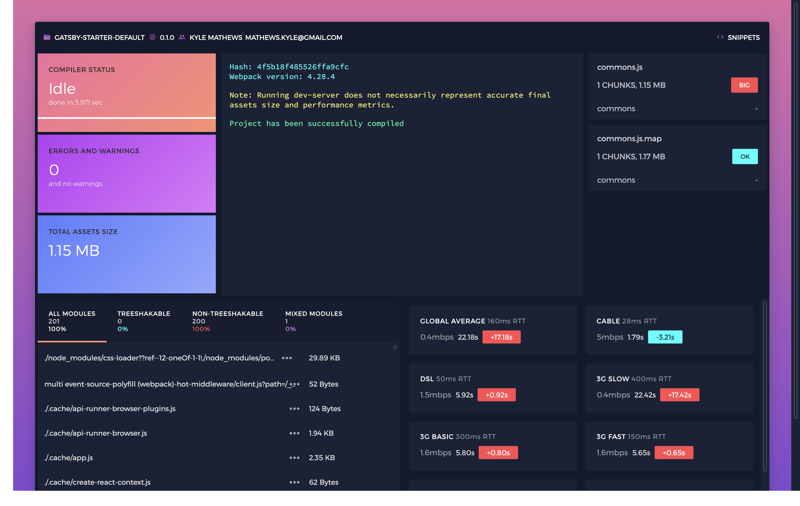

# gatsby-plugin-jarvis

Gatsby support for [JARVIS](https://github.com/zouhir/jarvis). Webpack
analytics.



# Get Started

```sh
yarn add gatsby-plugin-jarvis webpack-jarvis
```

Add to `gatsby-config.js`.

```js
module.exports = {
  plugins: [`gatsby-plugin-jarvis`]
};
```

View on localhost:1337 by default

## Options

Accepts any JARVIS options: https://github.com/zouhir/jarvis#options

## Notes

For more accurate analytics, run with the production env. Even so, the analytics
do not represent the final post-minification values and as such may be off for
various reasons.

```
NDOE_ENV=production gatsby develop
```
